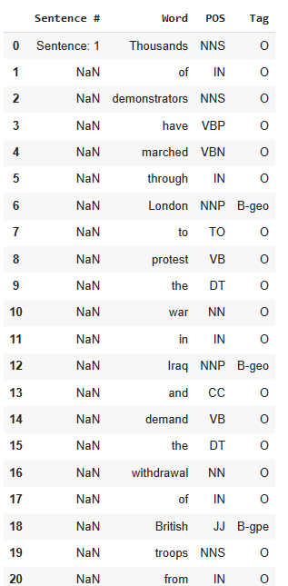
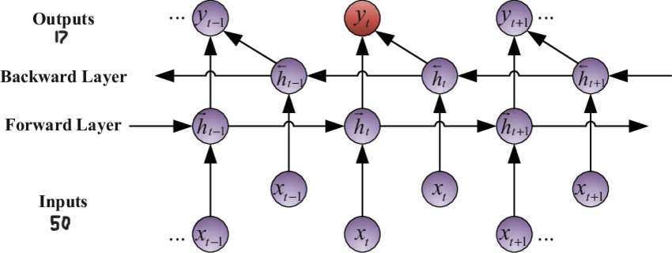
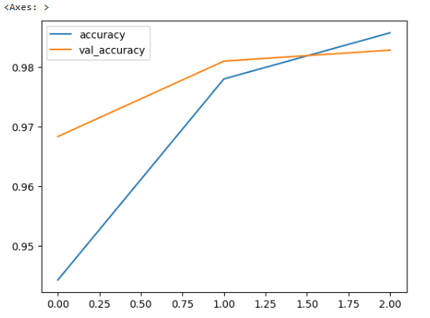
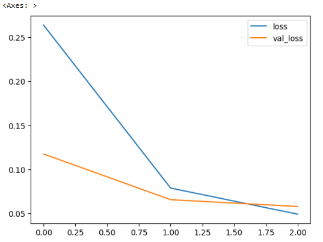

# Named Entity Recognition

## AIM

To develop an LSTM-based model for recognizing the named entities in the text.

## Problem Statement and Dataset
In this experiment, bidirectional recurrent neural networks are used to construct an LSTM-based neural network model for named entity recognition. Each sentence in the dataset has a large number of terms and their accompanying tags. We vectorize these sentences using Embedding techniques to train our model.Recurrent neural networks that function in both directions can combine the outputs of two hidden layers. This kind of generative deep learning allows the output layer to receive input from both past and future states concurrently.



## Neural Network Model


## DESIGN STEPS

* STEP 1: Import the required packages and Import the dataset.
* STEP 2: Check for the empty values and fill the null values accordingly.
* STEP 3: Get the count of the unique words in the given dataset 
* STEP 4: Create the list of words and tags
* STEP 5: Make the index for words and tags
* STEP 6: Assign the values of x and y
* STEP 7: Create , Compile and fit the dataset

## PROGRAM
```
Name:M.Hariharan
Reg.No:212221230034
```
## Importing the required packages
~~~
import matplotlib.pyplot as plt
import pandas as pd
import numpy as np
from tensorflow.keras.preprocessing import sequence
from sklearn.model_selection import train_test_split
from keras import layers
from keras.models import Model
~~~
## Importing the dataset
~~~
data = pd.read_csv("ner_dataset.csv", encoding="latin1")
~~~
## Filling the null values with previous values
~~~
data = data.fillna(method="ffill")
~~~
## Getting the count of unique words
~~~
print("Unique words in corpus:", data['Word'].nunique())
print("Unique tags in corpus:", data['Tag'].nunique())
~~~
## creating the lists 
~~~

words=list(data['Word'].unique())
words.append("ENDPAD")
tags=list(data['Tag'].unique())
~~~
## Printing the unique tags
~~~
print("Unique tags are:", tags)
~~~ 
## Creating the sentencegetter class
~~~
class SentenceGetter(object):
    def __init__(self, data):
        self.n_sent = 1
        self.data = data
        self.empty = False
        agg_func = lambda s: [(w, p, t) for w, p, t in zip(s["Word"].values.tolist(),
                                                           s["POS"].values.tolist(),
                                                           s["Tag"].values.tolist())]
        self.grouped = self.data.groupby("Sentence #").apply(agg_func)
        self.sentences = [s for s in self.grouped]

    def get_next(self):
        try:
            s = self.grouped["Sentence: {}".format(self.n_sent)]
            self.n_sent += 1
            return s
        except:
            return None
getter = SentenceGetter(data)
sentences = getter.sentences
~~~
## Making the index values for words and tags 
~~~
word2idx = {w: i + 1 for i, w in enumerate(words)}
tag2idx = {t: i for i, t in enumerate(tags)}
~~~

## plotting the history
~~~
plt.hist([len(s) for s in sentences], bins=50)
plt.show()
     
~~~
## Assigning the values 
~~~
X1 = [[word2idx[w[0]] for w in s] for s in sentences]
y1 = [[tag2idx[w[2]] for w in s] for s in sentences]
max_len = 50
~~~
## Assigning the x value
~~~

X = sequence.pad_sequences(maxlen=max_len,
                  sequences=X1, padding="post",
                  value=num_words-1)

~~~
## Assigning the y value
~~~
y = sequence.pad_sequences(maxlen=max_len,
                  sequences=y1,
                  padding="post",
                  value=tag2idx["O"])
     
~~~
## Creating the model
~~~
input_word = layers.Input(shape=(max_len,))

embedding_layer = layers.Embedding(input_dim=num_words,output_dim=50,
                                   input_length=max_len)(input_word)
dropout = layers.SpatialDropout1D(0.1)(embedding_layer)

bid_lstm = layers.Bidirectional(
    layers.LSTM(units=100,return_sequences=True,
                recurrent_dropout=0.1))(dropout)

output = layers.TimeDistributed(
    layers.Dense(num_tags,activation="softmax"))(bid_lstm)

model = Model(input_word, output)
~~~
## Compiling the model
~~~
model.compile(optimizer="adam",
              loss="sparse_categorical_crossentropy",
              metrics=["accuracy"])
~~~
## Fitting the model
~~~
history = model.fit(
    x=X_train,
    y=y_train,
    validation_data=(X_test,y_test),
    batch_size=32,
    epochs=3,
)
~~~
## Dataframe of metrics
~~~
metrics = pd.DataFrame(model.history.history)
metrics.head()
~~~
## ploting the metrics
~~~
metrics[['accuracy','val_accuracy']].plot()
metrics[['loss','val_loss']].plot()
~~~
## Sample text prediction
~~~

i = 50
p = model.predict(np.array([X_test[i]]))
p = np.argmax(p, axis=-1)
y_true = y_test[i]
print("{:15}{:5}\t {}\n".format("Word", "True", "Pred"))
print("-" *30)
for w, true, pred in zip(X_test[i], y_true, p[0]):
    print("{:15}{}\t{}".format(words[w-1], tags[true], tags[pred]))
~~~


## OUTPUT
### Training Loss, Validation Loss Vs Iteration Plot



### Sample Text Prediction


## RESULT
Therefore an LSTM-based deep learning model for recognizing the named entities in the text is successfully develooped.
